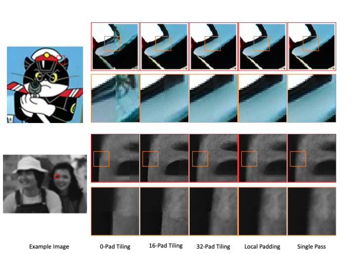

# RealESRGAN-LP

## Introduction
RealESRGAN-LP is an improved version of the RealESRGAN model designed to eliminate tiling artifacts when super-resolving large inputs. Tiling artifacts are common in super-resolution tasks when processing large images due to the necessity of dividing the image into smaller patches for processing. 

The following is quoted from Real-ESRGAN official reop:

"Note that it may introduce block inconsistency (and also generate slightly different results from the PyTorch implementation), because this executable file first crops the input image into several tiles, and then processes them separately, finally stitches together."
This modification aims to enhance the performance of RealESRGAN by addressing these artifacts.

## Modification Details
- **Patch-Based Inference with Local Padding**: RealESRGAN-LP utilizes patch-based inference with local padding instead of zero-padding. This approach involves padding inputs and activations with content from neighboring patches, allowing the model to maintain consistency and continuity across patch boundaries, thereby reducing artifacts caused by patch-based processing.

## Inference with local padding
Local padding is directly applied to the pre-trained model by dropping all the zero paddings and instead use local padding in patch-based inference mode. The following code can be used to to perform inference with local padding:

```
python inference_realesrgan.py -n RealESRGAN_x4plus_lp -i inputs --fp32 --generator_patch_size 64 --num_patches_height 3 --num_patches_width 3
```
```generator_patch_size``` is the patch size processed by the generator, setting it to 0 will run the model in a single shot mode.
```num_patches_height, num_patches_width``` values determine the number of patches to be combined together when processing the inputs. They can be set to be larger for faster processing.

The current implementation does not work on 4-channel 16-bit images. They could be added in the future. 
## Comparision between differet tiling results and our local padding techniques


#


## Requirements
The requiremnets are the same as in the original RealESRGAN repo
